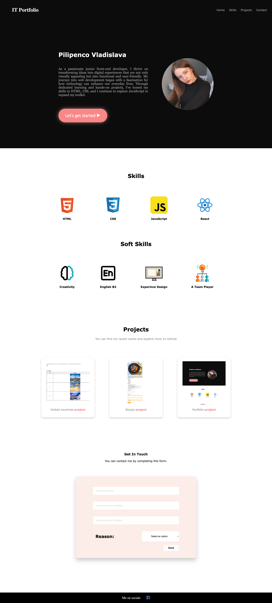

# Prima versiune de portfolio

## Construiţi o pagină web cu numele “My portfolio” după structura ce urmează:

- [x] Header: Titlul, navigare către secțiunile: Home, Skills, Projects, Contact
- [x] Secţiunile “Skills” şi “Project” vor avea titlu, descriere şi câte o listă
- [x] Secţiunea “Contact” va conţine o formă de contact cu câmpurile: numele, nr. de tel, email, motivul de contact (selectaţi una din opţiuni - interviu sau angajare)
- [x] Footer-ul va conţine text şi link către pagina de Facebook

# Live Preview

<a href="https://html-preview.github.io/?url=https://github.com/vladapilipenco/odc-homeworks/blob/main/02-portfolio-v1/index.html" target="_blank">My Portfolio Page</a>

# Screenshot

