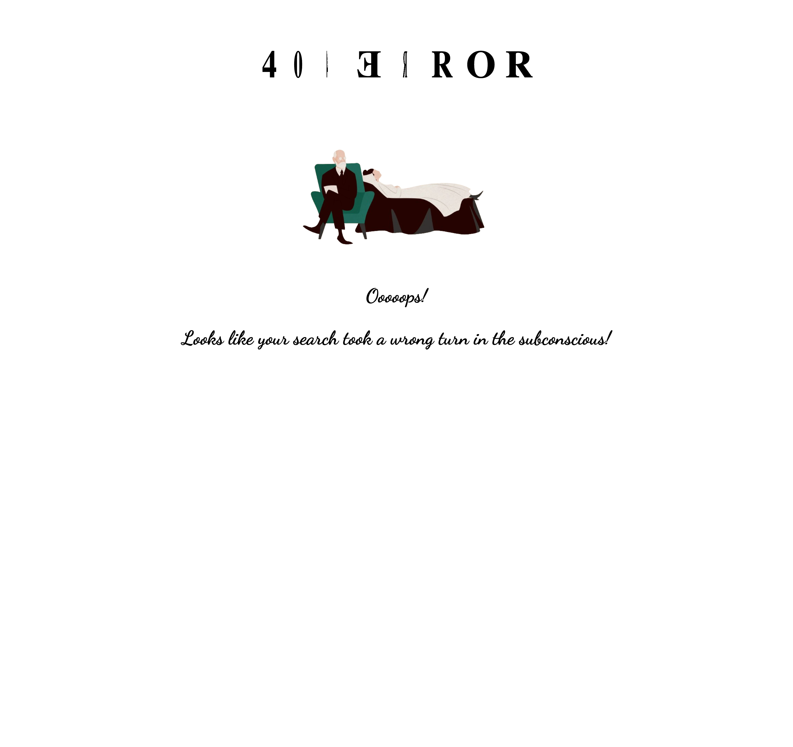

# Temă pentru acasă - o pagină de eroare 404 personalizată

Paginile de eroare 404 sunt de obicei plictisitoare și generice, nu?

Dar când un vizitator nu poate găsi ceea ce caută, cu siguranţă aţi dori să evitaţi ca acesta să părăsească site-ul dvs.

În schimb, ar trebui să creați o pagină personalizată de eroare 404 care este utilă și valoroasă și chiar amuzantă și distractivă.

O pagină grozavă 404 poate face utilizatorii să zâmbească și, mai important, îi poate ajuta să găsească ceea ce caută. Vizitatorii dvs vor aprecia efortul cu siguranţă.

# Live Preview

<a href="https://html-preview.github.io/?url=https://github.com/vladapilipenco/odc-homeworks/blob/main/05-error-404-page/index.html" target="_blank">Awkward Page</a>

# Screenshot

