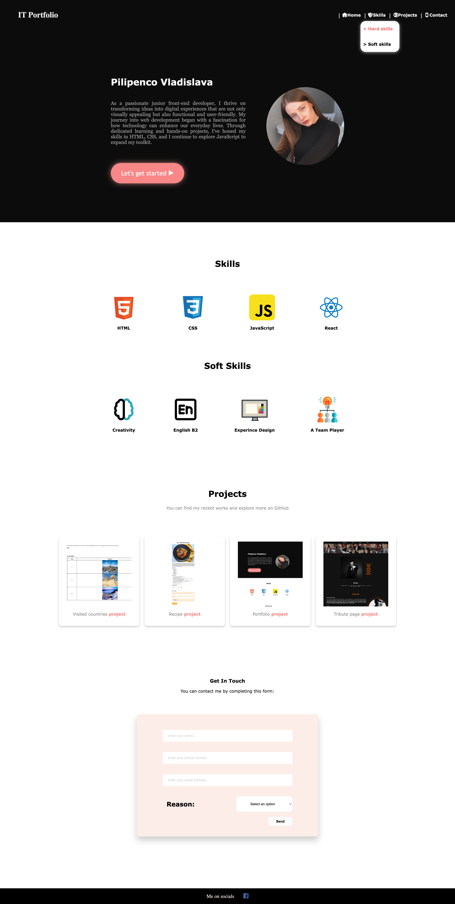

# Facem (sau utilizãm ce avem deja) un menu de navigare cu submeniu

- [x] Elementele nivelului 1 vor fi separate prin bară " |" (inafară de ultimul), vor avea
      iconită in fat, in stare activă vor avea alt background si vor fi bold, iar la acoperire
      cu mouse-ul vor avea alt background si vor fi subliniate.
- [x] Elementele nivelului 2 nu vor avea iconitã in fat, ci simbolul ">" si adăugător
      efectelor hover de la elementele de mai sus, vor avea si un background schimbat.

# Live Preview

<a href="https://html-preview.github.io/?url=https://github.com/vladapilipenco/odc-homeworks/blob/main/07-dropdown-menu/index.html" target="_blank">Portfolio with dropdown menu</a>

# Screenshot

