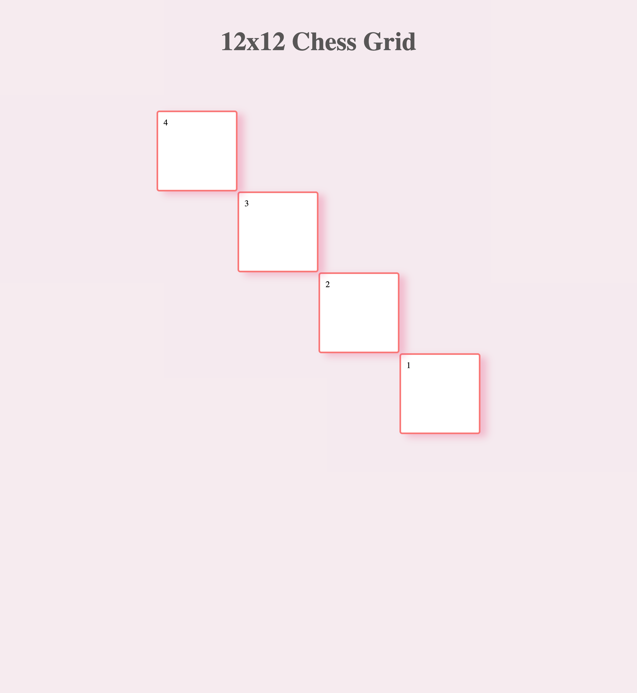

# Exercițiul 2 - Chess Grid

- [x] Avem un grid 12x12
- [x] Conţine 4 elemente copii (items)
- [x] Toate items trebuie să aibă dimensiuni identice
- [x] Ordinea aranjării lor: 4 - 2 - 3 - 1

# Live Preview

<a href="https://html-preview.github.io/?url=https://github.com/vladapilipenco/odc-homeworks/blob/main/12-grid-exercises/chess-grid/index.html" target="_blank">Chess Grid</a>

# Screenshot

