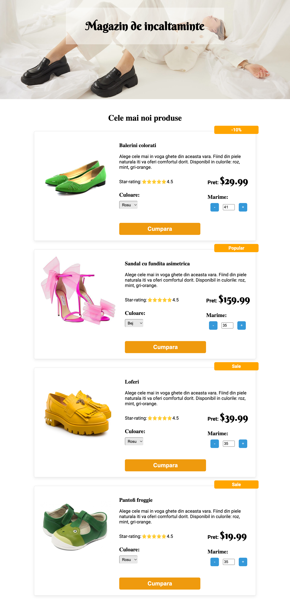
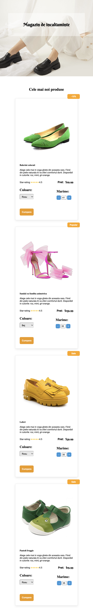
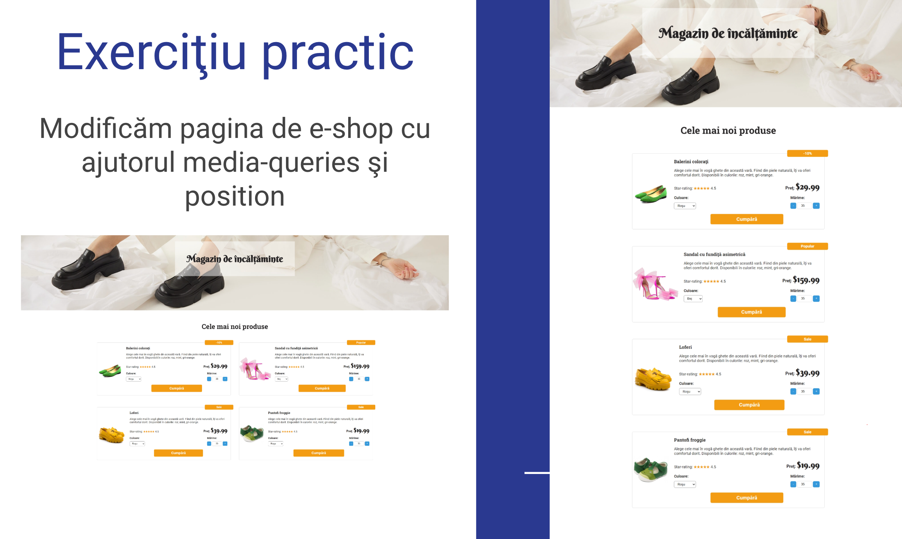

# Making E-shop Project Design Responsive

## Modificăm pagina de e-shop cu ajutorul media-queries şi position

# Live preview

<a href="https://html-preview.github.io/?url=https://github.com/vladapilipenco/odc-homeworks/blob/main/14-media-queries-e-shop/index.html" target="_blank">Responsive E-shop</a>

# Screenshots:

# Desktop e-shop version

# Tablet e-shop version (ex. IPad Pro)

# Mobile e-shop version (ex.IPhone 14 Pro Max)

# Task Refference

